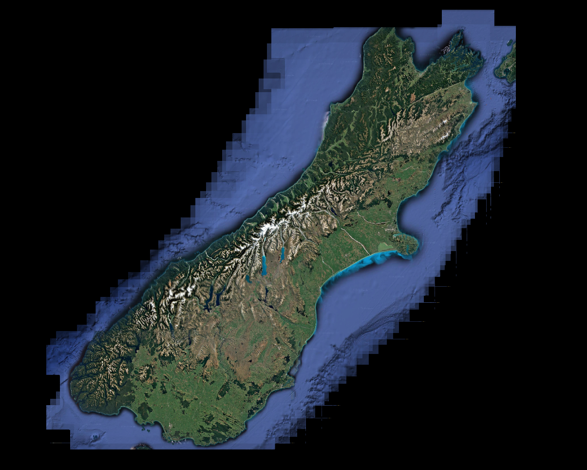

# mungus
A screenshot aligner that stitches images as you walk through a 2d environment. The [BRIEF](https://doi.org/10.1007/978-3-642-15561-1_56) algorithm is used to perform pairwise image alignment.

When running continuously, the aligner can consecutively stitch full resolution screenshots fast and accurately enough to recreate the entire map in Among Us:

Another example computed from Google Maps satellite views of New Zealand's south island:

